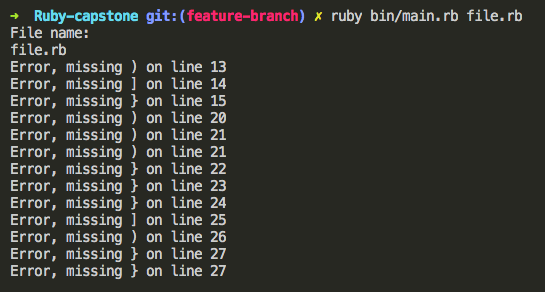
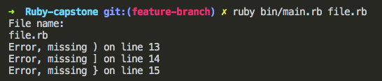
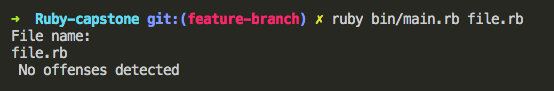
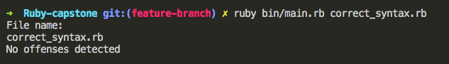

# Ruby Capstone project. A Detector for unclosed parentheses
A lint project for detecting unclosed braces and parentheses

## Built With

- Ruby
- Robocop

## Getting Started

**This program will throw you error messages when there is a missing Parenthesis ), Curly bracket } or Square bracket ]**

### Prerequisites

- Terminal
- Ruby (Don't forget to have it previously installed in your computer)

### Instructions

- Clone this repository into your computer and open it 

- Open file.rb in your prefered code editor and write your code inside of it and save your changes 

### Usage and tests

- in your terminal find the route to the repository and execute the main.rb file, remember to put next to it the name of the file "file.rb" 

- Then the program will show you the path of your file and also in which lines there are missing close parentheses

- As you can see, the error messages match the lines where the missing parentheses are 

- In case there are no syntax errors in your file, you will get a message like this one, it will show you a message that there are no errors, and also will show you the path to your file 

**IMPORTANT** If you wish to rename your file don't forget to change the route to said file, in order to do so just replace the old name for the new one when executing the main.rb file 

**That's it!**  I hope this code will help you find your missing elements 😀

## Author

👤 **José Francisco Silva Díaz**

- Github: [@SunnySparks](https://github.com/sunnySparks)
- Twitter: [@JosFranT6](https://twitter.com/josfrant6)
- Linkedin: [linkedin](https://www.linkedin.com/in/josé-francisco-silva-díaz-a2a9421a6)

## 🤝 Contributing

Contributions, issues and feature requests are welcome!
Any feedback is appreciated

Feel free to check the [issues page](issues/).

## Show your support

Give a ⭐️ if you like this project, this will help me grow as a developer!

## 📝 License

This project is [MIT](lic.url) licensed.
